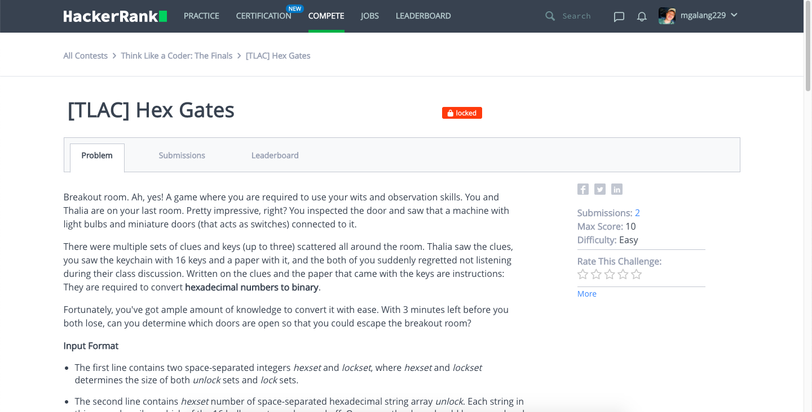
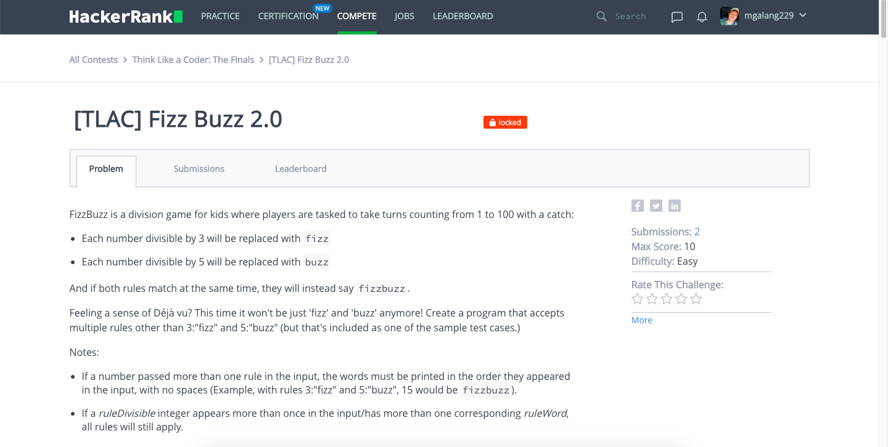
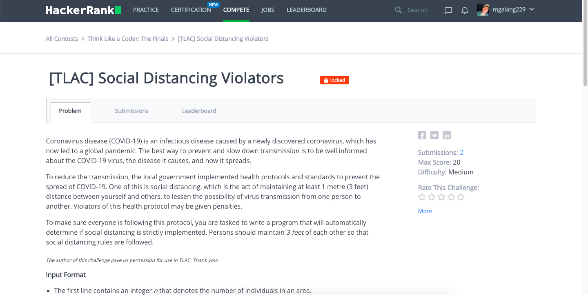
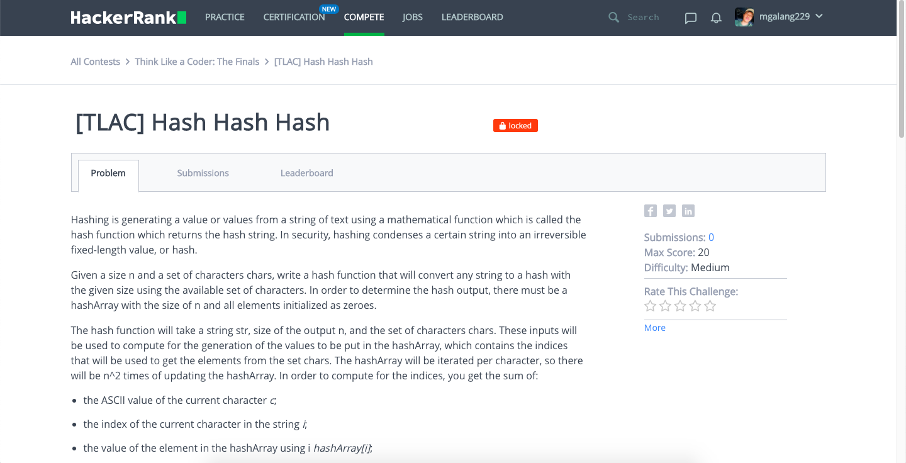
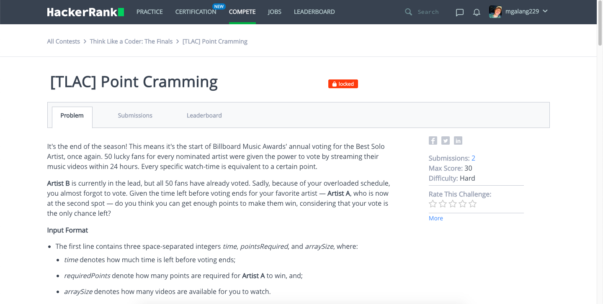
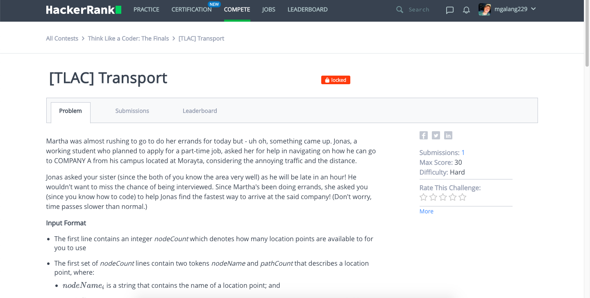

# Think-Like-a-Coder-The-Finals
## Hex Gates (Easy) (My Score: 10/10)

## Fizz Buzz 2.0 (Easy) (My Score: 10/10)

## Social Distancing Violators (Medium) (My Score: 20/20)

## Hash Hash Hash (Medium) (No Answer)

## Point Cramming (Hard) (No Answer)

## Transport (Hard) (No Answer)

## Summary
# I got a total of 40 points which made me the #2 in the final scoreboard.
